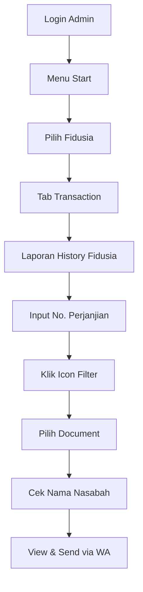

# 📊 Cara Tarik Data Nasabah

> [!NOTE] **Kapan digunakan?**  
> Saat diminta collector/lewat grup "`minta data`"

> [!WARNING] **PENTING!**  
> Untuk pencarian nama:  
> `NAMA*` (gunakan asterisk di akhir)  
> Contoh:  
> `JhonDoe*`

### Diagram Alur Proses

