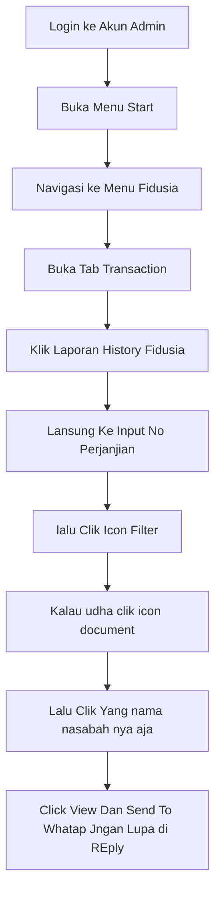

# cara Tarik Data Nasabah 

> [!NOTE]
> Metode Ini DI Gunakan biasanya jika di minta collector atau di grub `minta data`

> [!WARNING]
> kalau Mau Input Pakai Nama Setelah nama pakai tanda `*`
>
> Contoh :
>
> `JhonDoe*`

