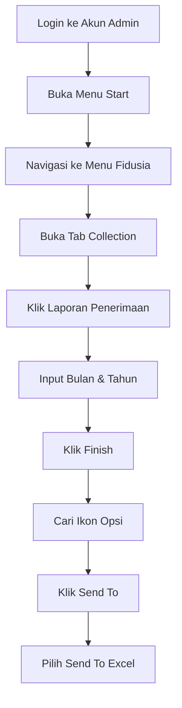

# Cara Update Data 

oke sebenarnay update data itu gampang nah tapi ada tisp and tric nya, nah apa aja itu simak di bawah ini 

---

<!-- TOC start (generated with https://github.com/derlin/bitdowntoc) -->

- [1. Ambil Data Penerimaan Di ERV](#1-ambil-data-penerimaan-di-erv)
   * [Diagram Alur Proses](#diagram-alur-proses)
- [2. lalu Ambil File master sebagai template dan buka juga file penerimaan yang udah di downloads](#2-lalu-ambil-file-master-sebagai-template-dan-buka-juga-file-penerimaan-yang-udah-di-downloads)
   * [tahap 1.](#tahap-1)
   * [Tahap 2](#tahap-2)
   * [Tahab 3](#tahab-3)
      + [Bucket `c`](#bucket-c)
      + [Bucket `C0`](#bucket-c0)
         - [langkah 1](#langkah-1)
         - [langkag 2](#langkag-2)
      + [Bucket `C1`](#bucket-c1)
- [Catatan](#catatan)
- [Rumus Yang Harus DI Ingat](#rumus-yang-harus-di-ingat)

<!-- TOC end -->

<!-- TOC --><a name="1-ambil-data-penerimaan-di-erv"></a>
## 1. Ambil Data Penerimaan Di [ERV](http://erp.indoprof.co.id/WSWebClient/Default.aspx)


Berikut langkah-langkah lengkap untuk mengambil data penerimaan dari sistem ERV:

<!-- TOC --><a name="diagram-alur-proses"></a>
### Diagram Alur Proses


- login ke akun admin ( `baca wa` )
- kalau udah login ke menu `start`
- lalu ke menu `fidusia`
- lalu ke tab `penerimaan` dan --> click `laporan penerimaan`
- masukan bulan yang mau di tarik contoh `7`
- mauskan tahun contoh `2025`
- lalu click `finish`
- kalau udah nanti akan ada icon kayak gini 
- lalu kalau udah kalian `clik aja icon itu` bebas dimana aja nnti kan ada tap namanya `send to` _lihat teiti_ lalu clik itu dan clik lagi `send to excel` 
- llau nti `otomatis downloads`

---

<!-- TOC --><a name="2-lalu-ambil-file-master-sebagai-template-dan-buka-juga-file-penerimaan-yang-udah-di-downloads"></a>
## 2. lalu Ambil File master sebagai template dan buka juga file penerimaan yang udah di downloads

nah jadi kalau udha di buka 2 file excel nya di file `master` buat aja sheet baru dan salin isi dari file excels yang `penerimaan` lalu paste kan ke **`SHEET YANG BARU DI BUAT`**. 

> [!WARNING]
> Pastikan di sheet yang di tempel itu pas atau sama kalau ngak `matilah kau`, nti repot lah kau disini.

kalau udah kita lanjut lagi ke taham selanujut nya

<!-- TOC --><a name="tahap-1"></a>
### tahap 1.
nah di tahap ini kau cuman `VLOOKUP` kan di kolom `Penerimaan` nah itu dia untuk pengaturan nya kayak gini 
```sh
=VLOOKUP(nilai_dicari, rentang_tabel, nomor_kolom, [tipe_cocok])

# nah ini kita ganti ke kayak gini 

=VLOOKUP(No Perjanjian, SheetPenerimaanDariNomorPerjanjianSampaiColomPenerimaanCollector, Biasanya20KalauNgakKoHitungAjaSendiri, [0/FALSE])
```

nah kayak gitu lah kira kira istilahnya.

trus ko salin aja itu sampai ke baris paling bawah atau teken aja 2x kayak di materi [w3schools.com/excel_fill_double_click](https://www.w3schools.com/excel/excel_fill_double_click.php)

nah nnti haisl nya di colom itu akan otomatis ke vlookup 

> [!NOTE]
> PASTIKAN PASS `VLOOKUP` JANGAN LUPA KUNCI BARIS NYA `$` CONTOH SEBELUM `A2:H8` SESUDAH `A$2:H$8` NAH KUNCI NYA PAKAI CARA `FN + F4` 2x
> kalau ngak ngeti liat di [w3schools.com/excel/excel_abs_ref](https://www.w3schools.com/excel/excel_abs_ref.php)
> udah belajar juga maish g tau longor"


<!-- TOC --><a name="tahap-2"></a>
### Tahap 2

nah kan udah kita vlookup in kan si penerimaan itu, sekarang kita tinggal mainin si filter gimana cara nya?
gini caranya

1. clik kolom penerimaan
2. tekan filter di tab filter
3. **lalu di penerimaan filter `CUMAN YANG 0 AJA` ULANG YA YANG `0` AJA PENERIMAAN NYA**
4. lalu di `KOLOM ACT PENYELESAIAN` Ubah semua status nya jadi `TARIKAN` ULANGI **`UBAH SEMUA STATUS NYA JADI TARIKAN`**
5. lalu clear filter
6. di **`KOLOM PENERIMAAN`** filter yang **`ADA ANGKA NYA AJA`** ULANGI **`YANG ADA ANGKA NYA AJA YANG DI FILTER`**
7. kalau udah di kolom **`ACT PENYELESAIAN NYA BUAT STATUS NYA JADI DONE`**
8. LALU `CLEAR FILTER` DAN LALU SEKARANG KITA FILTER YANG PENERIMAAN NYA `#N/A`
9. KALAU UDAH DI `#N/A` MAKA `ACT PENYELESAIAN` NYA JADI `GAGAL BAYAR`


> [!TIP]
> `FYI` KALAU DI TAHAP 2 JANGAN FILTER APAPUN KECUALI PENERIMAAN

---

<!-- TOC --><a name="tahab-3"></a>
### Tahab 3

Nah Skearang kita udha di bigian agak pening ya 

oke di tahap ini kita usahakan mulai dari bucket dan kuitansi yang terkecil dulu.
oe kita mulai dari bucket c dst

<!-- TOC --><a name="bucket-c"></a>
#### Bucket `c`
kalau di bucket c ini kan langkah 1 ya
jadi kaluan cuman ubah `act pnyelesaian` yang `gagal bayar` trus ubah jadi `BELUM JTO`

<!-- TOC --><a name="bucket-c0"></a>
#### Bucket `C0`
kalau di buket ini ada 2 lankah dan agak ribet 

<!-- TOC --><a name="langkah-1"></a>
##### langkah 1

Kita Filter `ACT PENYELESAIAN` nya cuman yang `Gagal Bayar`, Nah lalu di KOLOM `JTO CICILAN` itu kita filter yang selain bukan tanggal hari ini 

contoh sekarang kan tanggal `7` nah trsu kita cuman filter dari tanggal `1` sampai tanggal `7` sisanya di ceclisk dan buat `ACT PENYELESAIAN` nya jadi `BELUM JTO`

<!-- TOC --><a name="langkag-2"></a>
##### langkag 2

kalau di langkah ke 2 ini kita cuman perlu `FILTER` `ACT PENYELESAIAN` Yang `Done` kalau udah jangan lupa bucket nya cuman `C0` nah baru kita periksa kwitansi nya

<!-- TOC --><a name="bucket-c1"></a>
#### Bucket `C1`

Nah Untuk DI Bucketet `C1` --> `CX*` Cuman Periksa Act Peneyelsaian Yang done aja 
proses nya itu sama aja kayak proes kwitansi di `C0` 

<!-- TOC --><a name="catatan"></a>
## Catatan

> [!NOTE]
> Kalau nasabar Kwitansi nya 1 dan dia dari bucket `C1` Keatas Maka `STAY`
> Kalau Nasabah `Kwitansi` Nya Dan `Sisa Tenor` Sama maka Status `ACT PENYELESAIAN` NYA `LUNAS`

<!-- TOC --><a name="rumus-yang-harus-di-ingat"></a>
## Rumus Yang Harus DI Ingat

> [!WARNING]
> * KALAU `KWITANSI` DAN `TENOR` ITU `SAMA` MAKA `ACT PENYELESAIAN` NYA `LUNAS`
>
> * KALAU UNTUK BUCKET `C` HANYA PERIKSA YANG GAGAL BAYAR AJA ATAU DI PENJELSANA [#bucket-c](#bucket-c)
> * KALAU BUCKET `C0` ADA 2 [#langkah-1](#langkah-1) sama [#langkah-2](#langkag-2)