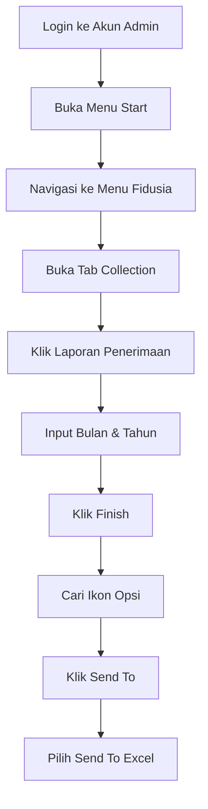

# Cara Update Data 

oke sebenarnay update data itu gampang nah tapi ada tisp and tric nya, nah apa aja itu simak di bawah ini 

---

## 1. Ambil Data Penerimaan Di [ERV](http://erp.indoprof.co.id/WSWebClient/Default.aspx)


Berikut langkah-langkah lengkap untuk mengambil data penerimaan dari sistem ERV:

### Diagram Alur Proses


- login ke akun admin ( `baca wa` )
- kalau udah login ke menu `start`
- lalu ke menu `fidusia`
- lalu ke tab `penerimaan` dan --> click `laporan penerimaan`
- masukan bulan yang mau di tarik contoh `7`
- mauskan tahun contoh `2025`
- lalu click `finish`
- kalau udah nanti akan ada icon kayak gini 
- lalu kalau udah kalian `clik aja icon itu` bebas dimana aja nnti kan ada tap namanya `send to` _lihat teiti_ lalu clik itu dan clik lagi `send to excel` 
- llau nti `otomatis downloads`

---

## 2. lalu Ambil File master sebagai template dan buka juga file penerimaan yang udah di downloads

nah jadi kalau udha di buka 2 file excel nya di file `master` buat aja sheet baru dan salin isi dari file excels yang `penerimaan` lalu paste kan ke **`SHEET YANG BARU DI BUAT`**. 

> [!WARNING]
> Pastikan di sheet yang di tempel itu pas atau sama kalau ngak `matilah kau`, nti repot lah kau disini.

kalau udah kita lanjut lagi ke taham selanujut nya

### tahap 1.
nah di tahap ini kau cuman `VLOOKUP` kan di kolom `Penerimaan` nah itu dia untuk pengaturan nya kayak gini 
```sh
=VLOOKUP(nilai_dicari, rentang_tabel, nomor_kolom, [tipe_cocok])

# nah ini kita ganti ke kayak gini 

=VLOOKUP(No Perjanjian, SheetPenerimaanDariNomorPerjanjianSampaiColomPenerimaanCollector, Biasanya20KalauNgakKoHitungAjaSendiri, [0/FALSE])
```

nah kayak gitu lah kira kira istilahnya.

trus ko salin aja itu sampai ke baris paling bawah atau teken aja 2x kayak di materi [w3schools.com/excel_fill_double_click](https://www.w3schools.com/excel/excel_fill_double_click.php)

nah nnti haisl nya di colom itu akan otomatis ke vlookup 

> [!NOTE]
> PASTIKAN PASS `VLOOKUP` JANGAN LUPA KUNCI BARIS NYA `$` CONTOH SEBELUM `A2:H8` SESUDAH `A$2:H$8` NAH KUNCI NYA PAKAI CARA `FN + F4` 2x
> kalau ngak ngeti liat di [w3schools.com/excel/excel_abs_ref](https://www.w3schools.com/excel/excel_abs_ref.php)
> udah belajar juga maish g tau longor"


### Tahap 2

nah kan udah kita vlookup in kan si penerimaan itu, sekarang kita tinggal mainin si filter gimana cara nya?
gini caranya

1. clik kolom penerimaan
2. tekan filter di tab filter
3. **lalu di penerimaan filter `CUMAN YANG 0 AJA` ULANG YA YANG `0` AJA PENERIMAAN NYA**
4. lalu di `KOLOM ACT PENYELESAIAN` Ubah semua status nya jadi `TARIKAN` ULANGI **`UBAH SEMUA STATUS NYA JADI TARIKAN`**
5. lalu clear filter
6. di **`KOLOM PENERIMAAN`** filter yang **`ADA ANGKA NYA AJA`** ULANGI **`YANG ADA ANGKA NYA AJA YANG DI FILTER`**
7. kalau udah di kolom **``**